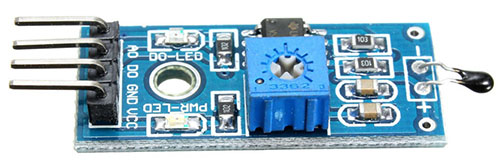
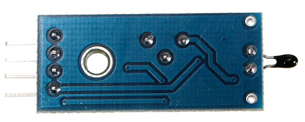
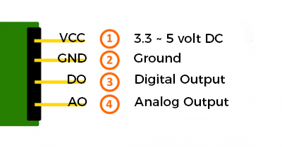
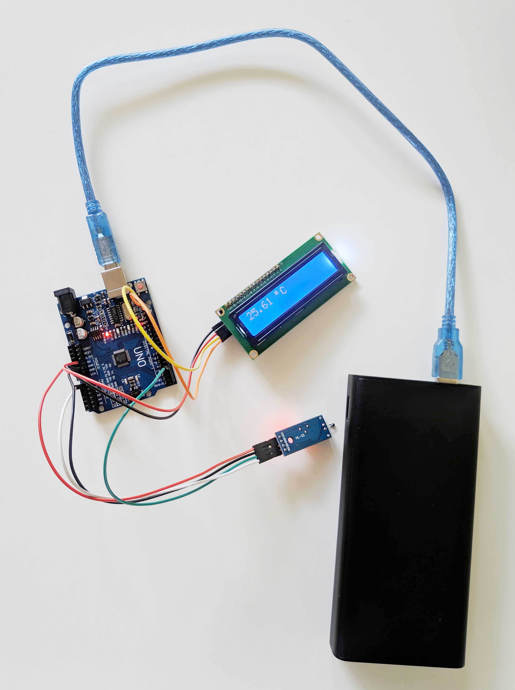

# 4 PIN NTC Thermistor Temperature Sensor Module Arduino Code
#### Arduino Code to Read Temperature from 4 pin NTC Thermistor

NTC Thermistor temperature sensor module is low cost, small size module. It is very sensitive to ambient temperature. It is generally used to detect the temperature of the surrounding environment.


## Picture 



## Technical data / Short description
This module includes a NTC Thermistor - its resistance falls with higher temperature.<br>
<strong>Digital Out (DO)</strong>: While measuring a temperature which is higher than the limit value, it will be shown here - you can set the limit value via potentiometer.<br>
<strong>Analog Out (AO)</strong>: Direct measurement of the sensor unit.<br>

<strong>LED1 (PWR)</strong>: Shows that the sensor is receiving power. <br>
<strong>LED2 (OUT)</strong>: Shows that a digital high was detected. <br>

<strong>Operating voltage (Vcc)</strong>: 3.3 ~ 5(volt)<br>
<strong>Temperature sense range</strong> : -25 ~ 80(°C) <br>

## Pinout


## Functionality of the sensor
Negative Temperature Coefficient (NTC) thermistors, resistance decreases as temperature rises.
Resistance Descreases = Current Increases due to low resistance. 

So, lowest temperature of the thermistor will be lowest current flow. This thermistor's lowest value is -25°C & highest value is +80°C (Your could be different check with the specification manual).

### For 5.0v
Volt (DC)         : 0.0 (Min) _ _ _ _ _ _ _ _ _ _ _ 5.0 (Max)
Temperature (°C)  : -25 (Min) _ _ _ _ _ _ _ _ _ _ _ 80  (Max)

### For 3.3v
Volt (DC)         : 0.0 (Min) _ _ _ _ _ _ _ _ _ _ _ 3.3 (Max)
Temperature (°C)  : -25 (Min) _ _ _ _ _ _ _ _ _ _ _ 80  (Max)

So, Analog Output(AO) pin from the sensor module will output a current ranging from 0.0v to 5.0v. if sensor sends 0.0 from AO pin then we have to interprete -25°C detected at the thermistor.

Now, The ATmega controllers used for the Arduino contain an onboard 6 channel (8 channels on the Mini and Nano, 16 on the Mega) analog-to-digital (A/D) converter. The converter has 10 bit resolution, returning integers from 0 to 1023. 

### For 5.0v
Volt (DC)         : 0.0 (Min) _ _ _ _ _ _ _ _ _ _ _ 5.0  (Max)
Temperature (°C)  : -25 (Min) _ _ _ _ _ _ _ _ _ _ _ 80   (Max)
A/D Converter     :   0 (Min) _ _ _ _ _ _ _ _ _ _ _ 1023 (Max)

### For 3.3v
Volt (DC)         : 0.0 (Min) _ _ _ _ _ _ _ _ _ _ _ 3.3  (Max)
Temperature (°C)  : -25 (Min) _ _ _ _ _ _ _ _ _ _ _ 80   (Max)
A/D Converter     :   0 (Min) _ _ _ _ _ _ _ _ _ _ _ 675.18 (Max) // (1023/5.0) * 3.3 = 675.18 Arduino will always expect 5.0 volt we have to adjust for the same.

So, Analog Output(AO) pin read from the arduino will output a current ranging from 0 to 1023. if arduino reads 0 from AO pin then we have to interprete -25°C detected at the thermistor.

## Code example Arduino
```

int Analog_PIN = A0; // Analog PIN A0
int Digital_PIN = 3; // Digital PIN 3

int Min_Temperature = -25;
int Max_Temperature = 80;

void setup ()
{
  pinMode (Analog_PIN, INPUT);
  pinMode (Digital_PIN, INPUT);
       
  Serial.begin (9600); // serial output with 9600 bps
}
  
// The program reads the current values at the input pins
// and outputs them at the serial output
void loop ()
{
  float Analog;
  float Tf;
  float Tc;
  int Digital;

  int Temp_Range = (abs(Min_Temperature) + abs(Max_Temperature));

  Analog = analogRead(Analog_PIN);   
  Tf = Analog * (Temp_Range / 1023.0); // 0 - 1023 is Default Arduino 10 bit resolution for A/D Converter, https://www.arduino.cc/en/Tutorial/AnalogInputPins
  Tc = (Tf - 32) * 5/9; // Fahrenheit to Celsius Formula (32°F − 32) × 5/9 = 0°C
  Digital = digitalRead (Digital_PIN);
    
  //... and outputted here
  Serial.print ("Analog value:"); Serial.print (Analog);
  Serial.print ("Temp (F): "); Serial.print (Tf);
  Serial.print ("Temp (C): "); Serial.print (Tc);
  Serial.print ("Digital Value:"); Serial.print(Digital);
  Serial.println ("----------------------------------------------------------------");
  delay (200);
}

```

## Code Explaination


## Finally


